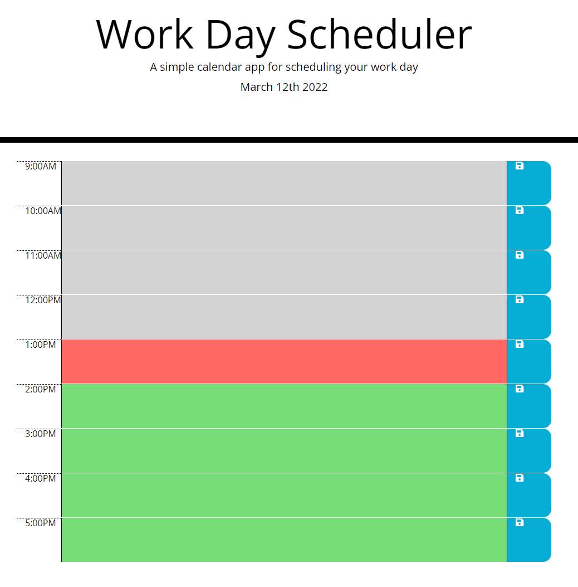

# Work Day Scheduler
This application is a work day scheduler that allows the user to add tasks throughout their work day.

## Features
- Input various tasks throughout the work day at a specified block of time.
- Visual color coding of task based on current time (past, present, and future).
- Ability to save the task by clicking the save button.

## Screenshot

## Deployed Application
You can find the deployed application [HERE](https://jwhitney2209.github.io/word-day-scheduler/)

